# 🛡️ Mini SOC in the Cloud: Elastic SIEM + AI Alert Triage

**Can a single student build the core loop of a Security Operations Center?** I deployed a Windows server on AWS, monitored it with Elastic's EDR agent, wrote my own detection rule mapped to MITRE ATT&CK, and automated alert triage: every alert is sent to Tines, summarized by an AI, and emailed to the analyst.

**Result:** running `whoami` on the server produced an AI-written alert summary in my inbox within a few minutes, fully automatically, with no human in between.

---

## 🗺️ Architecture

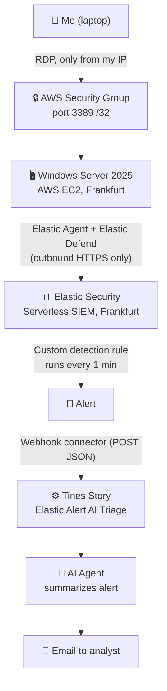

| Component | Details |
|---|---|
| Cloud | AWS Free plan, region eu-central-1 (Frankfurt) |
| Endpoint | Windows Server 2025, c7i-flex.large (2 vCPU, 4 GB RAM) |
| SIEM | Elastic Security Serverless (Security Complete tier, 14-day trial) |
| EDR | Elastic Agent 9.5.4 with Elastic Defend (Complete EDR) + System integration |
| Detection | Custom KQL rule, MITRE ATT&CK T1033 |
| Automation (SOAR) | Tines Stories: Webhook → AI Agent → Send Email |
| Date | September / October 2026 |

---

## 📊 Results at a glance

| # | What I tested | Result |
|---|---|---|
| 1 | Agent enrolment | 🟢 Agent "Healthy" in Fleet, ~1,000 events in the first 15 minutes |
| 2 | Custom rule on `whoami.exe` | 🟢 Rule fired: Medium alerts on the correct host |
| 3 | Tines flow with a fake alert | 🟢 AI summary email received in about 1 minute |
| 4 | Full end-to-end run | 🟢 Real alert → Tines → AI → email, fully automatic |
| 5 | Alert quality | 🟡 1 execution created 2 alerts (process start + end event) |

---

## 🔒 Security baseline (before building anything)

- **MFA** on the AWS root account
- **Zero-spend budget alert** to catch unexpected costs
- **RDP restricted to my own IP** (`/32`) in the security group, so the server is not exposed to internet-wide password guessing
- The Elastic Agent only makes **outbound** connections; no extra inbound port was opened
- The AI Agent has **no tools** (no web search, no code execution): it only needs to read and summarize

---

## 🧪 Step by step

### 1. Cloud server
Launched Windows Server 2025 in Frankfurt with a key pair (the only way to decrypt the Administrator password) and a security group allowing RDP from my IP only.

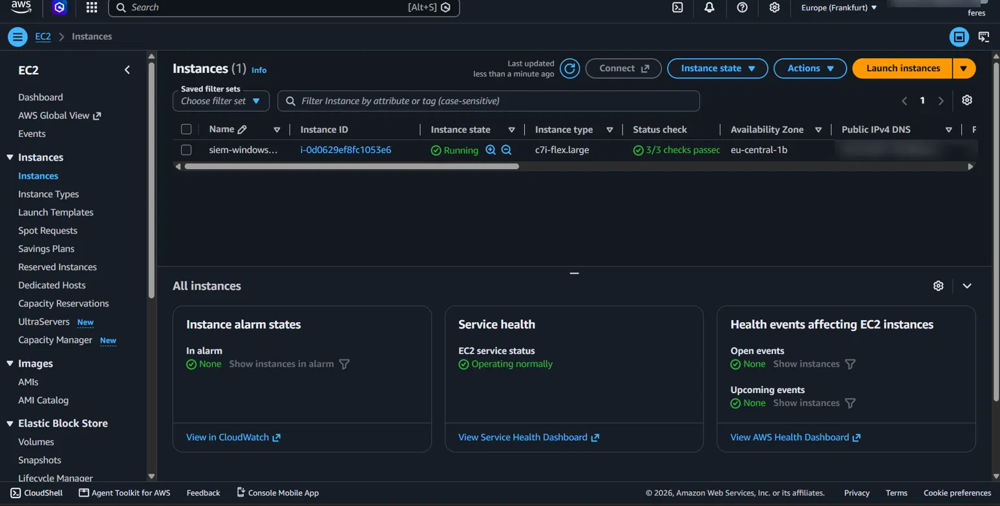
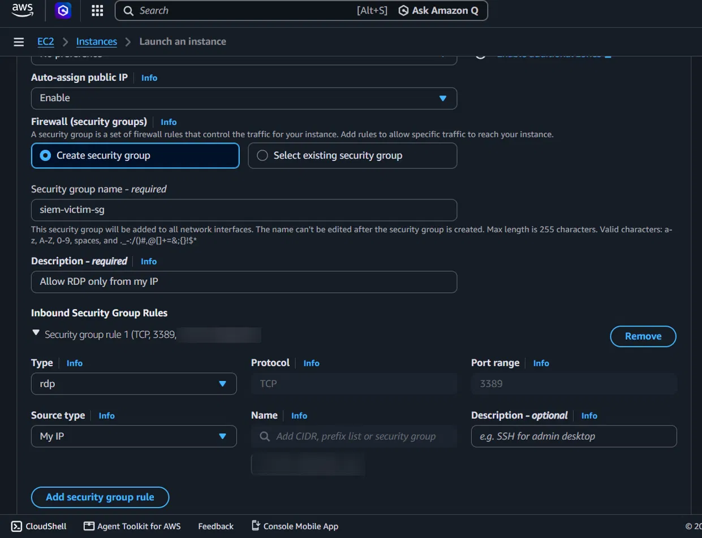

### 2. Elastic SIEM + EDR agent
Created an Elastic Security serverless project, added the **Elastic Defend** integration (Complete EDR) with the System integration in the policy `windows-victim-policy`, and installed the agent on the server with PowerShell (as Administrator) using a Fleet enrolment token.

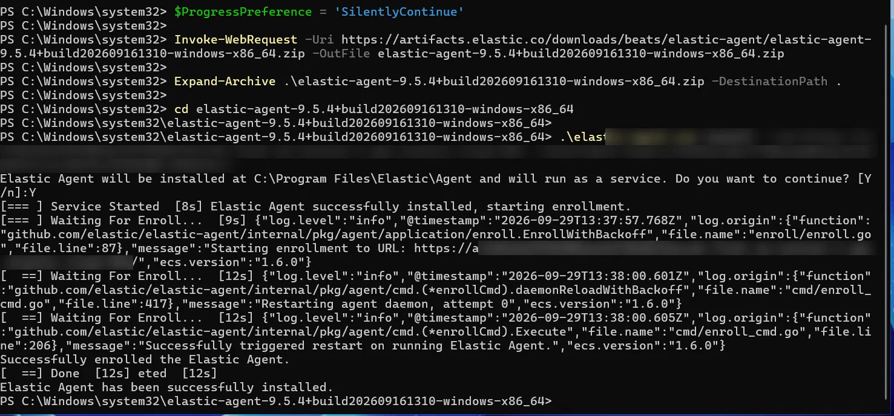
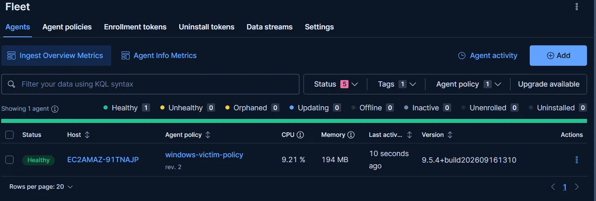
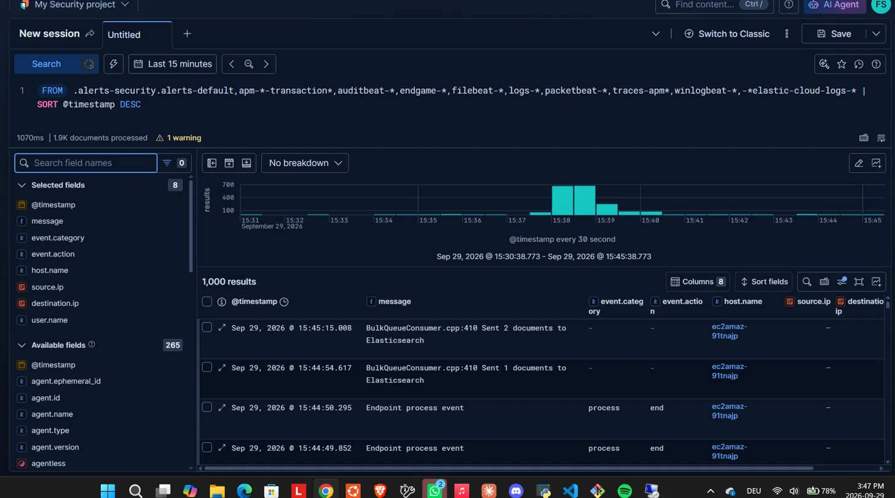

### 3. Custom detection rule
`whoami` is harmless on its own, but attackers often run it right after gaining access to check their user and privileges (**MITRE ATT&CK T1033, System Owner/User Discovery**). That makes it a realistic and safe way to test detection.

```
Rule:      Whoami Execution - User Discovery
Type:      Custom query (KQL)
Query:     process.name : "whoami.exe"
Severity:  Medium
Schedule:  every 1 minute
```

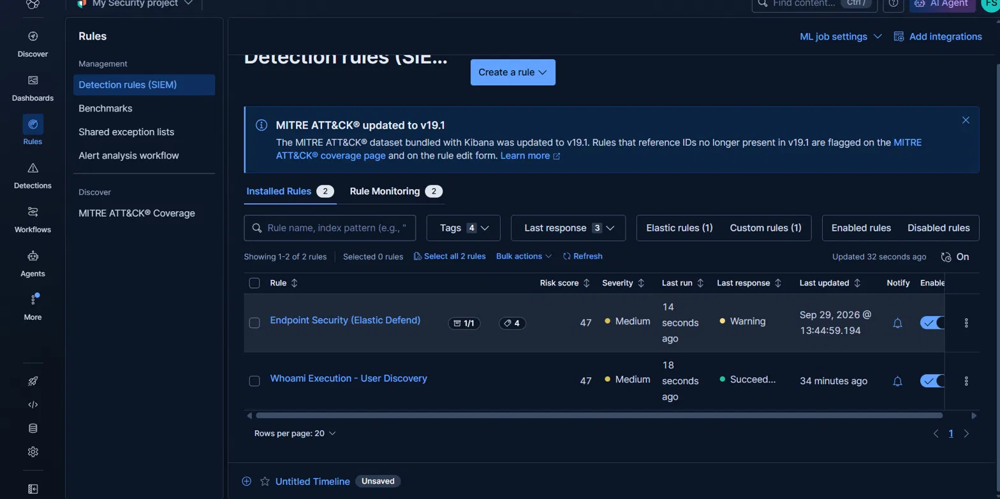
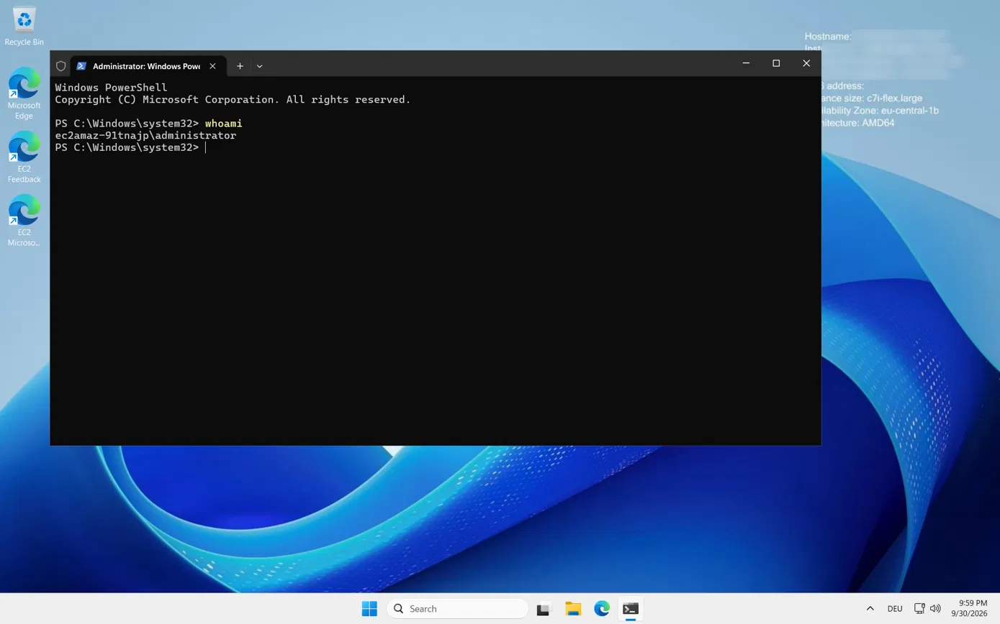
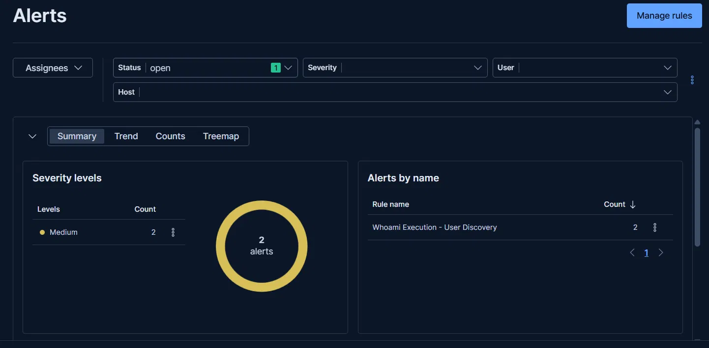

### 4. Automated triage with Tines + AI
A Tines story with three actions:
1. **Webhook** receives the alert from Elastic
2. **AI Agent** (Task) summarizes it: what happened, host and user, why it matters (MITRE), severity, next steps
3. **Send Email** delivers the summary to the analyst

The AI's rules (system instructions) are kept separate from the alert data (prompt), and the instructions tell the model to treat alert content strictly as data, as a basic defense against prompt injection through attacker-controlled fields.

I first tested the flow with a fake alert sent from PowerShell (`Invoke-RestMethod`), then connected Elastic through a **Webhook connector** on the rule (summary of alerts, per rule run).

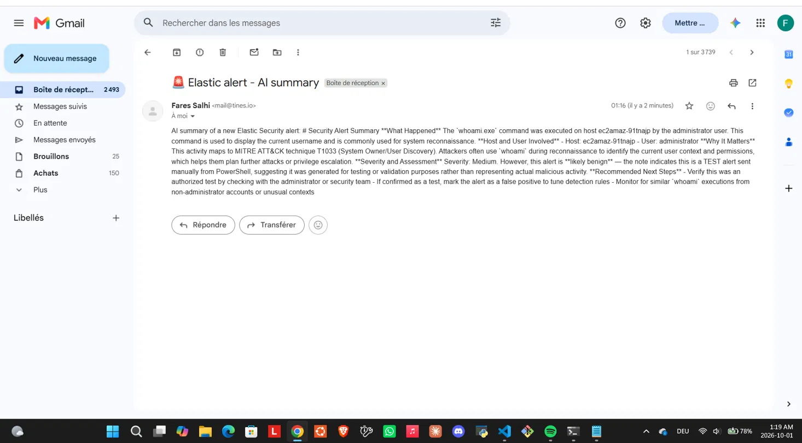
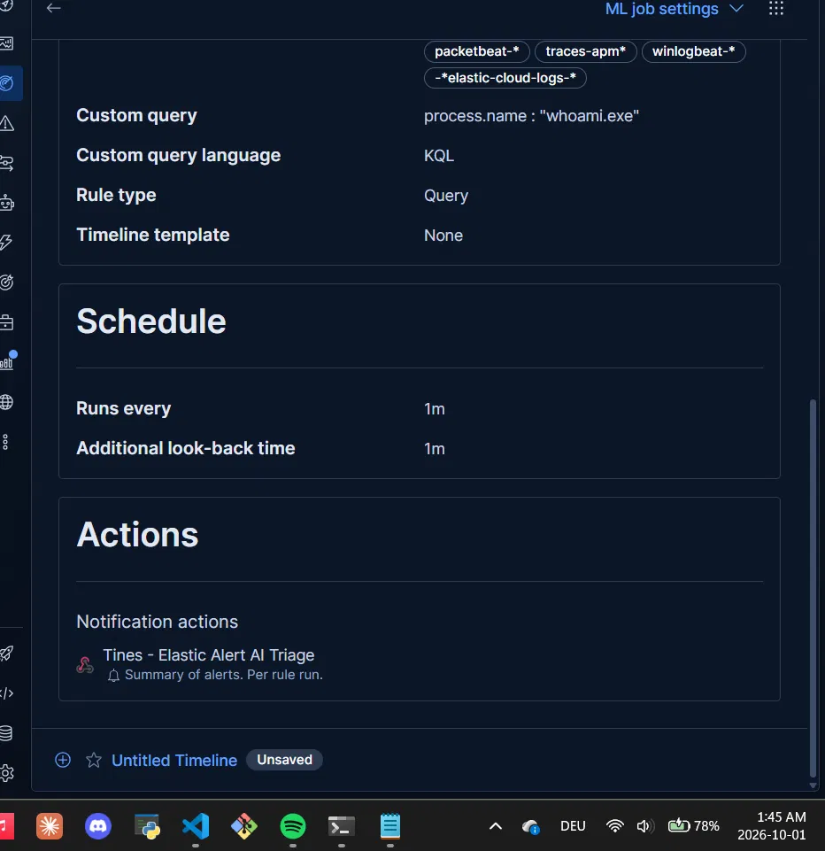

### 5. End-to-end run
Ran `whoami` on the server. A few minutes later the AI summary arrived by email with the correct host, user (`Administrator`), timestamp and MITRE technique, plus suggested next steps such as reviewing the parent process and command-line arguments.

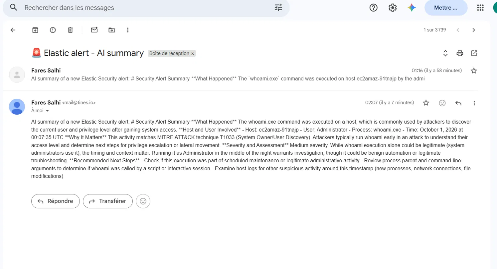

---

## 💡 Lessons learned

1. **AWS resources are per region.** My first server was launched in N. Virginia by mistake because the console switched region. Key pairs and security groups don't follow you across regions.
2. **IP-restricted rules need maintenance.** When my provider changed my home IP, my own firewall rule locked me out. The control worked, and fixing it meant updating the rule, not opening it to everyone.
3. **One event can mean two alerts.** Elastic Defend logs both the start and the end of a process, so my rule produced 2 alerts for 1 execution. Rule logic has to match how the data is recorded.
4. **Test each stage alone.** Sending a fake alert into Tines first meant that, when the real pipeline ran, only the Elastic → Tines link was new.
5. **Alert content can steer the AI.** In the fake test, a `note` field saying "TEST alert" was enough for the AI to call it "likely benign". In a real SOC, attacker-controlled fields could do the same, so AI triage must stay advisory and the input must be treated as untrusted.
6. **Least privilege applies to AI too.** The triage agent got no tools because summarizing needs none.

---

## 🔧 What I'd improve

- **Reduce duplicate alerts:** `process.name : "whoami.exe" and event.type : "start"`
- **Put the Elastic alert link directly in the email**, not only in the data sent to the AI
- **Ask the AI for plain text** (no Markdown), which renders poorly in email
- **Test the triage AI against prompt injection:** put instructions into an alert field and check whether the summary changes
- **Add more detections** mapped to MITRE ATT&CK, e.g. repeated failed logins from the Windows Security log
- **Build the infrastructure as code** (e.g. Terraform) so the lab can be recreated and torn down reliably

---

## 📁 Repository structure

```
├── README.md
├── LAB-NOTES.md        # raw notebook written during the build
└── screenshots/        # evidence for every step (secrets, IPs and IDs blurred)
```

---

*Everything ran in my own AWS, Elastic and Tines accounts. No real systems were attacked: the only "suspicious" action was running the harmless `whoami` command on my own test server. Project idea inspired by [@andrewcyberjones](https://www.youtube.com/@andrewcyberjones) on YouTube; I built and tested every step hands-on in my own accounts.*
